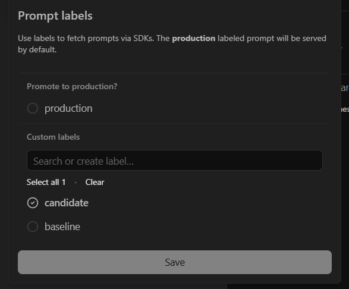

# Báo cáo Day 13 Observability

## 1. Thông tin nhóm

- Tên nhóm:
- Repository URL:
- Commit SHA cuối:
- Thành viên và vai trò:

## 2. Kết quả kỹ thuật

- Điểm `validate_logs.py`:
- Tổng số traces:
- Số PII leak còn lại:
- Link/đường dẫn dashboard:

## 3. Logging và tracing

- Evidence correlation ID:
- Evidence PII redaction:
- Evidence trace waterfall:
- Giải thích một span đáng chú ý:

## 4. Prompt versioning

- Prompt name: day13-chat
- Version/label baseline: v1 (production, baseline)
- Version/label candidate: v2 (candidate)
- Trace ID của mỗi version: v1: e4b89ad34ce3c7d216ae3e354ce775bc, v2: d79157273d33e662a26d800e0d29d933
- Bằng chứng đổi label hoặc rollback: 

## 5. Dashboard, SLO và alerts

- Kết quả `validate_dashboard.py`:
- Evidence dashboard:
- SLO đã chọn và lý do:
- Alert rules và runbook:

## 6. Điều tra challenge

- Challenge ID: N/A (Practice Incident)
- Triệu chứng từ metrics: Latency P95 tăng vọt lên ~2650ms.
- Trace ID liên quan: 
- Log line/correlation ID liên quan: req-561b00e0
- Root cause: Bật lỗi giả lập rag_slow
- Fix action: Tắt lỗi giả lập bằng API
- Preventive measure: 

## 7. Đóng góp cá nhân

Với mỗi thành viên, ghi rõ nhiệm vụ và link commit/PR tương ứng.

| Thành viên | Phần việc | Commit/PR | Điều đã học |
|---|---|---|---|
| | | | |
